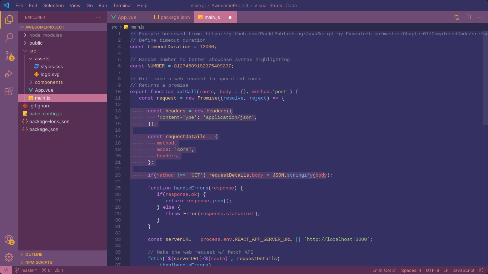
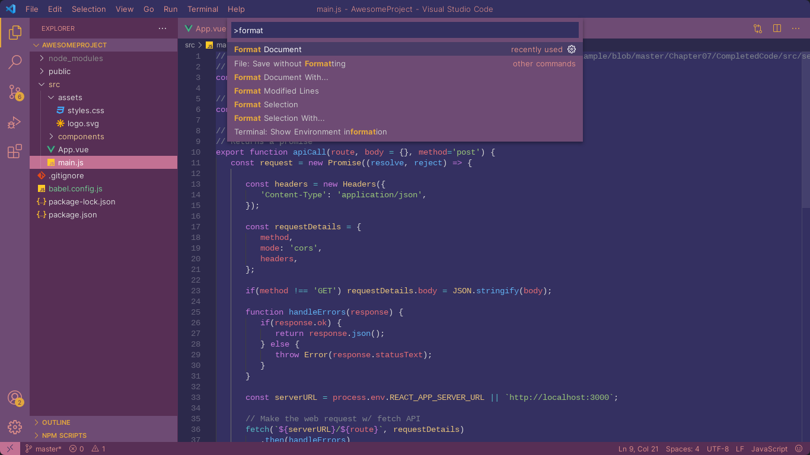
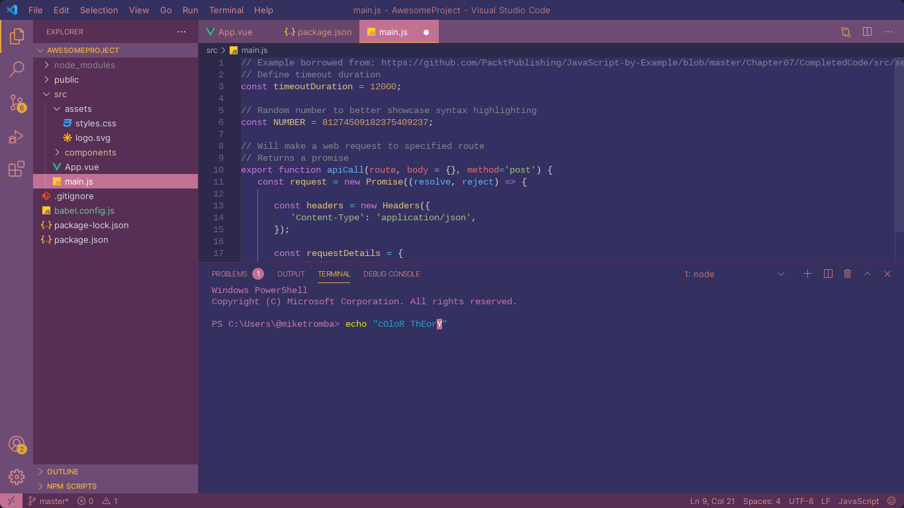

# Plum Torte Theme

This theme is based on the [Plum Torte Firefox theme](https://addons.mozilla.org/en-US/firefox/addon/plum-torte/) by say-hi and was made using [https://themes.vscode.one](https://themes.vscode.one). This is my first time making a theme so there might be some adjustments that need to be made. Either way, I hope you enjoy it 🪶

## Theme Examples
These examples were generated automatically on the vscode.one site.

<picture>  </picture>
<picture>  </picture>
<picture>  </picture>

